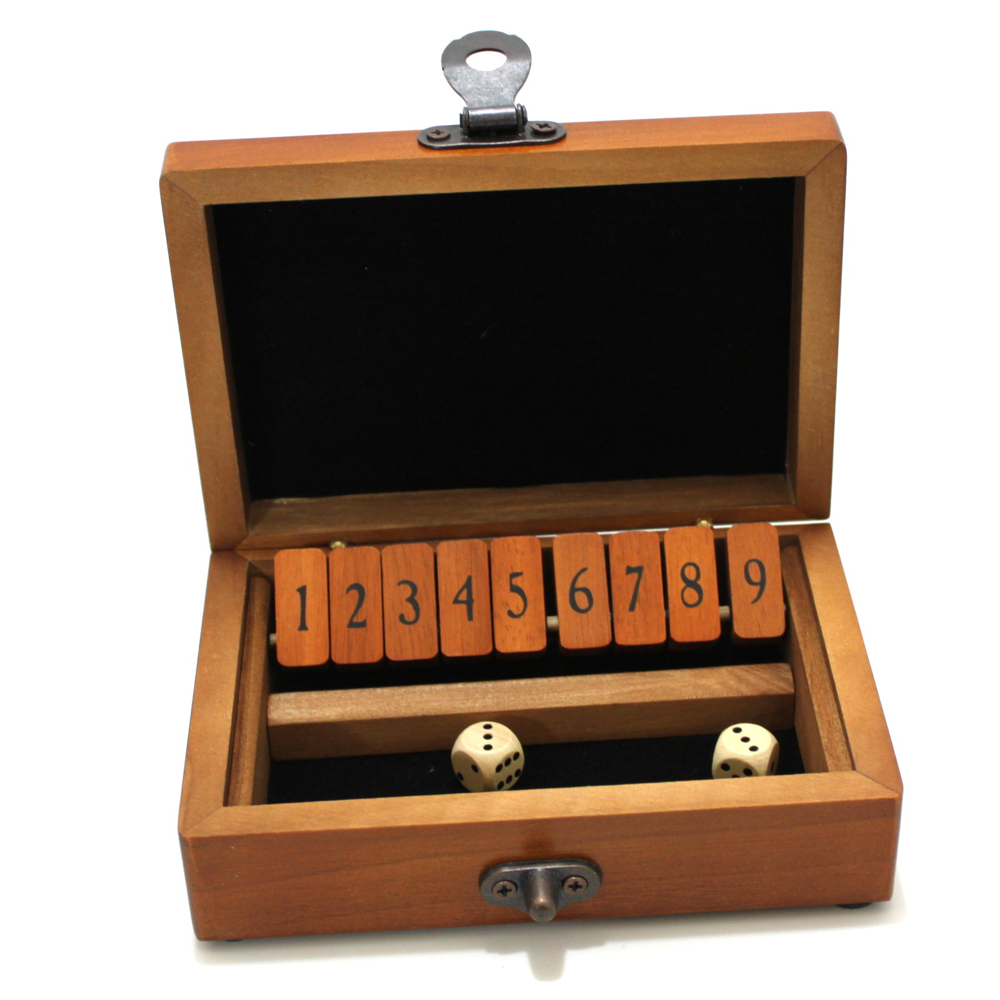

# Shut the Box

### Description
"Shut the Box" is a dice game (gambling often being involved) in which a player continually rolls dice and covers any tiles that add up to the sum of the dice. If you roll the dice and there is no combination of tiles that add up to the dice total, then your game is over and you sum the uncovered tiles for your score. If you successfully cover all of the tiles, then you win; you have shut the box!

### Rules
Here are the rules

You may have to use this command to get tkinter to work:
$ sudo apt-get install python3-tk
